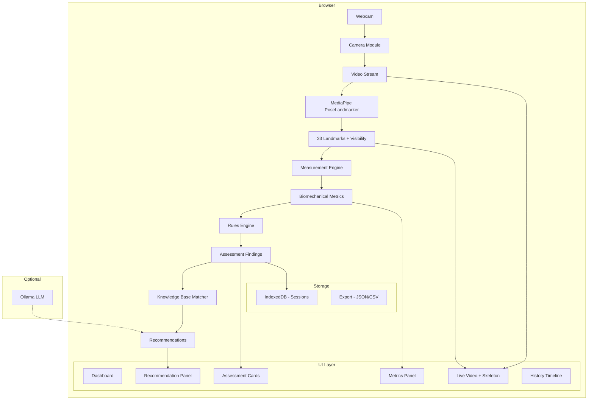
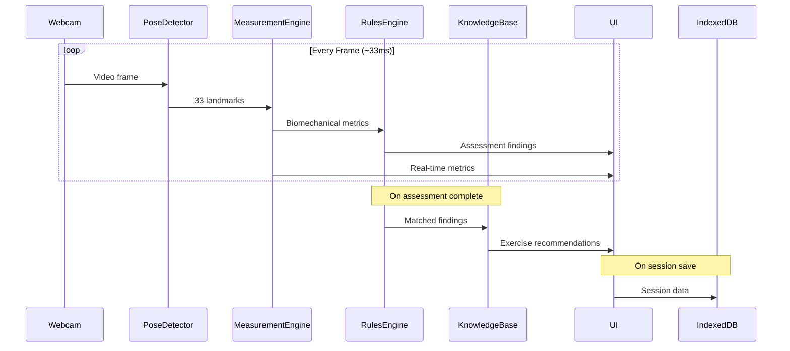

# Symmetry — AI-Powered Posture & Movement Assessment MVP

Build a local-first, privacy-focused web application that uses webcam + MediaPipe Pose to analyze posture and movement in real time, with a deterministic rules engine for assessment and a structured knowledge base for corrective exercise recommendations.

---

## User Review Required

> [!IMPORTANT]
> **TailwindCSS Version**: The spec requests TailwindCSS. I'll use **TailwindCSS v4** (latest) via `@tailwindcss/vite`. Please confirm or specify v3 if preferred.

> [!IMPORTANT]
> **Offline-First Model Hosting**: For true offline operation, the MediaPipe WASM runtime and model files (~5–15 MB) need to be downloaded once and served locally from `public/`. During development, the first `npm install` + initial load will fetch them from CDN, after which they'll be cached. Confirm this is acceptable vs. manually bundling model files in the repo.

> [!WARNING]
> **Webcam Mirroring & Landmark Sides**: MediaPipe returns landmarks from the subject's perspective (left=odd indices, right=even). When the camera is mirrored, the visual overlay must also be mirrored accordingly. The rules engine will always work in subject-space (un-mirrored). This is a common source of confusion — calling it out early.

---

## Open Questions

1. **Assessment Thresholds**: The spec mentions threshold-based rules (e.g., forward head > X°). I'll use evidence-based defaults from sports science literature. Should these be user-configurable from the start, or hardcoded for MVP?
2. **Ollama Integration**: The spec mentions optional LLM via Ollama. Should I include the Ollama integration in the MVP, or defer it to a stretch goal? I'll include a template-based fallback either way.
3. **Side-View Analysis**: Several posture metrics (forward head angle, pelvic tilt in sagittal plane) are most accurate from a side/lateral view. Should the MVP support a "switch to side view" prompt, or assume all analysis is frontal?

---

## Proposed Changes

The project will be built from scratch in `c:\Prasanna\antigravity\Symmetry` using Vite + React + TypeScript + TailwindCSS.

### Milestone 1 — Project Scaffolding & Design System

#### [NEW] Project initialization via Vite
- `npx -y create-vite@latest ./ --template react-ts`
- Install dependencies: `zustand`, `recharts`, `idb`, `@mediapipe/tasks-vision`
- Configure TailwindCSS v4 via `@tailwindcss/vite`
- ESLint + Prettier configuration
- TypeScript strict mode

#### [NEW] [src/index.css](file:///c:/Prasanna/antigravity/Symmetry/src/index.css)
- Dark-mode-first design system
- CSS custom properties for colors, spacing, typography
- Glassmorphism utilities
- Animation keyframes for micro-interactions
- Sports-science professional aesthetic (dark backgrounds, neon accent colors, clean data-driven layouts)

#### [NEW] [src/types/](file:///c:/Prasanna/antigravity/Symmetry/src/types/)
- `pose.ts` — Landmark, PoseResult, JointAngle types
- `assessment.ts` — Assessment, Finding, Severity, Confidence types
- `measurement.ts` — BiomechanicalMeasurement, PostureMetrics types
- `session.ts` — Session, SessionHistory types
- `recommendation.ts` — Exercise, Recommendation types
- `camera.ts` — CameraDevice, CameraConfig types

---

### Milestone 2 — Camera Module

#### [NEW] [src/camera/useCameraDevices.ts](file:///c:/Prasanna/antigravity/Symmetry/src/camera/useCameraDevices.ts)
- Enumerate available webcams via `navigator.mediaDevices.enumerateDevices()`
- Track permission state

#### [NEW] [src/camera/useCameraStream.ts](file:///c:/Prasanna/antigravity/Symmetry/src/camera/useCameraStream.ts)
- Start/stop camera stream
- Select device, request 30 FPS, configure resolution
- Handle permission errors gracefully

#### [NEW] [src/camera/CameraView.tsx](file:///c:/Prasanna/antigravity/Symmetry/src/camera/CameraView.tsx)
- Video element with mirror toggle (CSS `scaleX(-1)`)
- Fullscreen button via Fullscreen API
- Camera selector dropdown
- Start/Stop controls
- FPS counter overlay

#### [NEW] [src/stores/cameraStore.ts](file:///c:/Prasanna/antigravity/Symmetry/src/stores/cameraStore.ts)
- Zustand store: `isStreaming`, `isMirrored`, `isFullscreen`, `selectedDeviceId`, `fps`

---

### Milestone 3 — Pose Detection

#### [NEW] [src/pose/PoseDetector.ts](file:///c:/Prasanna/antigravity/Symmetry/src/pose/PoseDetector.ts)
- Initialize MediaPipe `PoseLandmarker` with `LIVE_STREAM` mode
- Load WASM + model from `/mediapipe/` (local public directory)
- Process video frames → return 33 landmarks with visibility scores
- FPS tracking and performance metrics

#### [NEW] [src/pose/landmarkConstants.ts](file:///c:/Prasanna/antigravity/Symmetry/src/pose/landmarkConstants.ts)
- Named constants for all 33 landmark indices
- Skeleton connection pairs for drawing
- Landmark labels for display

#### [NEW] [src/pose/SkeletonRenderer.ts](file:///c:/Prasanna/antigravity/Symmetry/src/pose/SkeletonRenderer.ts)
- Canvas-based skeleton overlay renderer
- Draw joints as colored circles (color = confidence)
- Draw bones as lines between connected joints
- Optional joint labels
- Confidence score badge
- Respect mirror mode

#### [NEW] [src/pose/PoseOverlay.tsx](file:///c:/Prasanna/antigravity/Symmetry/src/pose/PoseOverlay.tsx)
- Canvas element overlaid on video
- Renders skeleton, labels, confidence
- Synchronized with video frame updates

#### [NEW] [src/stores/poseStore.ts](file:///c:/Prasanna/antigravity/Symmetry/src/stores/poseStore.ts)
- Zustand store: `landmarks`, `worldLandmarks`, `confidence`, `isDetecting`, `fps`

---

### Milestone 4 — Biomechanical Measurements

#### [NEW] [src/measurements/angleCalculations.ts](file:///c:/Prasanna/antigravity/Symmetry/src/measurements/angleCalculations.ts)
- `angleBetweenPoints(a, b, c)` — angle at vertex B
- `angleToHorizontal(a, b)` — angle of line AB to horizontal
- `angleToVertical(a, b)` — angle of line AB to vertical
- `distanceBetween(a, b)` — Euclidean distance
- `midpoint(a, b)` — midpoint calculation
- All functions work with 2D and 3D coordinates

#### [NEW] [src/measurements/postureMetrics.ts](file:///c:/Prasanna/antigravity/Symmetry/src/measurements/postureMetrics.ts)
Calculate from landmarks:

| Metric | Landmarks Used | Calculation |
|--------|---------------|-------------|
| Forward head angle | Ear (7/8), Shoulder (11/12) | Angle of ear→shoulder line to vertical |
| Shoulder height diff | Shoulders (11, 12) | `abs(left_shoulder.y - right_shoulder.y)` normalized |
| Shoulder rotation | Shoulders (11, 12) | Z-depth difference between shoulders |
| Pelvic tilt | Hips (23, 24), Shoulders (11, 12) | Angle of hip line to horizontal |
| Pelvic rotation | Hips (23, 24) | Z-depth difference between hips |
| Hip shift | Hips (23, 24), midpoint of ankles | Lateral displacement of hip center vs ankle center |
| Knee valgus/varus | Hips (23/24), Knees (25/26), Ankles (27/28) | Angle at knee in frontal plane |
| Trunk lean | Shoulder midpoint, Hip midpoint | Angle of trunk line to vertical |
| Spinal alignment | Nose (0), Shoulder mid, Hip mid | Deviation of these points from straight line |
| Weight shift | Ankles (27, 28), pressure proxy from hip center | Lateral bias of center of mass |
| Symmetry score | All bilateral pairs | Mean of L/R symmetry across all metrics |

#### [NEW] [src/measurements/movementMetrics.ts](file:///c:/Prasanna/antigravity/Symmetry/src/measurements/movementMetrics.ts)
- Squat depth (hip-to-knee angle)
- Overhead reach (shoulder flexion angle)
- Single-leg balance (hip drop, trunk sway tracking over time)
- Forward bend (hip hinge angle, spine curvature estimate)

---

### Milestone 5 — Assessment Rules Engine

#### [NEW] [src/assessment/rulesEngine.ts](file:///c:/Prasanna/antigravity/Symmetry/src/assessment/rulesEngine.ts)
- Deterministic rules engine — NO ML classification
- Each rule: `{ id, name, metric, operator, threshold, severity, message, confidence }`
- Operators: `>`, `<`, `>=`, `<=`, `between`, `outside`
- Severity levels: `normal`, `mild`, `moderate`, `significant`
- Confidence: derived from landmark visibility scores

#### [NEW] [src/assessment/rules/](file:///c:/Prasanna/antigravity/Symmetry/src/assessment/rules/)
- `standingPostureRules.ts` — head position, shoulder symmetry, pelvis, knees, feet
- `overheadReachRules.ts` — shoulder mobility, trunk compensation, elbow extension
- `squatRules.ts` — depth, knee tracking, hip shift, trunk lean, heel lift, asymmetry
- `singleLegBalanceRules.ts` — hip stability, pelvic drop, trunk sway, balance time
- `forwardBendRules.ts` — spinal flexion, hip hinge, symmetry

Each file exports an array of `AssessmentRule` objects with evidence-based thresholds.

#### [NEW] [src/assessment/assessmentRunner.ts](file:///c:/Prasanna/antigravity/Symmetry/src/assessment/assessmentRunner.ts)
- Takes current measurements + selected test type
- Runs all applicable rules
- Returns `AssessmentResult`: findings, overall score, symmetry score
- Supports temporal aggregation (average over N frames for stability)

#### [NEW] [src/stores/assessmentStore.ts](file:///c:/Prasanna/antigravity/Symmetry/src/stores/assessmentStore.ts)
- Zustand store: `currentAssessment`, `activeTest`, `findings`, `overallScore`, `symmetryScore`

---

### Milestone 6 — Knowledge Base & Recommendations

#### [NEW] [src/knowledge/knowledgeBase.ts](file:///c:/Prasanna/antigravity/Symmetry/src/knowledge/knowledgeBase.ts)
Structured JSON knowledge base. Each entry:

```typescript
interface KnowledgeEntry {
  id: string;
  name: string;
  description: string;
  criteria: AssessmentCriteria[];
  recommendations: {
    mobility: Exercise[];
    strength: Exercise[];
    awareness: string[];
    dailyHabits: string[];
  };
}
```

Entries for: Forward Head, Rounded Shoulders, Shoulder Elevation, Anterior Pelvic Tilt, Posterior Pelvic Tilt, Lateral Pelvic Tilt, Hip Shift, Knee Valgus, Knee Varus, Trunk Lean, Weight Shift Asymmetry.

#### [NEW] [src/knowledge/recommendationEngine.ts](file:///c:/Prasanna/antigravity/Symmetry/src/knowledge/recommendationEngine.ts)
- Match assessment findings → knowledge base entries
- Generate prioritized recommendation list
- Template-based natural language explanation (fallback for no Ollama)

#### [NEW] [src/knowledge/ollamaIntegration.ts](file:///c:/Prasanna/antigravity/Symmetry/src/knowledge/ollamaIntegration.ts)
- Optional: Connect to local Ollama instance
- Prompt template with structured findings only (never images)
- Graceful fallback to templates if unavailable
- Health check on app start

---

### Milestone 7 — Dashboard UI

#### [NEW] [src/ui/Dashboard.tsx](file:///c:/Prasanna/antigravity/Symmetry/src/ui/Dashboard.tsx)
Main layout with responsive grid:
- Left: Live video + skeleton overlay (60% width)
- Right: Metrics panel + assessment results (40% width)
- Bottom: Recommendations + history

#### [NEW] [src/ui/components/](file:///c:/Prasanna/antigravity/Symmetry/src/ui/components/)
- `MetricsPanel.tsx` — Real-time biomechanical measurements display with gauges/bars
- `AssessmentCard.tsx` — Individual finding display with severity badge
- `RecommendationPanel.tsx` — Exercise recommendations with categories
- `MovementScore.tsx` — Circular gauge for overall movement score
- `SymmetryRadar.tsx` — Radar chart (Recharts) showing L/R symmetry
- `TestSelector.tsx` — Select movement test type (standing, squat, etc.)
- `SessionTimeline.tsx` — Historical sessions list with scores
- `ExportButton.tsx` — Export assessment data as JSON/CSV
- `Header.tsx` — App header with branding and settings
- `ConfidenceBadge.tsx` — Visual indicator of measurement confidence

#### [NEW] [src/ui/views/](file:///c:/Prasanna/antigravity/Symmetry/src/ui/views/)
- `LiveView.tsx` — Main assessment view (camera + overlay + real-time metrics)
- `HistoryView.tsx` — Past sessions browser with comparison
- `SettingsView.tsx` — Camera settings, thresholds, preferences

#### Design Aesthetic
- **Dark mode** primary with deep navy/charcoal backgrounds (#0a0e1a, #141825)
- **Accent colors**: Electric cyan (#00d4ff), Vibrant emerald (#00e676), Warm amber (#ffab00)
- **Severity colors**: Green (normal) → Yellow (mild) → Orange (moderate) → Red (significant)
- **Glassmorphism** cards with backdrop-blur and subtle borders
- **Typography**: Inter font family (Google Fonts)
- **Micro-animations**: Smooth transitions on metric changes, pulse on new findings
- **Data-dense** layout inspired by sports science dashboards (e.g., Catapult, VALD)

---

### Milestone 8 — Session History & Storage

#### [NEW] [src/storage/sessionStorage.ts](file:///c:/Prasanna/antigravity/Symmetry/src/storage/sessionStorage.ts)
- IndexedDB via `idb` library
- Schema: sessions store (date, type, measurements, scores, recommendations)
- CRUD operations: save, load, list, delete sessions
- Typed with `DBSchema`

#### [NEW] [src/storage/exportService.ts](file:///c:/Prasanna/antigravity/Symmetry/src/storage/exportService.ts)
- Export session as JSON
- Export session as CSV
- Future: PDF report generation (stretch)

#### [NEW] [src/stores/sessionStore.ts](file:///c:/Prasanna/antigravity/Symmetry/src/stores/sessionStore.ts)
- Zustand store: `sessions`, `currentSession`, `isRecording`
- Persist to IndexedDB on save

---

### Milestone 9 — Integration & Polish

#### [NEW] [src/App.tsx](file:///c:/Prasanna/antigravity/Symmetry/src/App.tsx)
- Root component with routing (hash-based, no server needed)
- Views: Live Assessment, History, Settings
- Global layout with sidebar navigation

#### [NEW] [src/hooks/](file:///c:/Prasanna/antigravity/Symmetry/src/hooks/)
- `usePoseLoop.ts` — Main requestAnimationFrame loop: capture frame → detect pose → compute metrics → run assessment
- `useFullscreen.ts` — Fullscreen API wrapper
- `useFPS.ts` — FPS counter

#### Performance Optimization
- Use `requestAnimationFrame` for detection loop
- Throttle assessment engine to run every 5th frame (save CPU)
- Memoize expensive calculations
- Use `React.memo` on heavy components
- Canvas rendering outside React reconciliation

---

### Milestone 10 — Documentation & Testing

#### [NEW] [README.md](file:///c:/Prasanna/antigravity/Symmetry/README.md)
- Project overview, features, screenshots
- Installation: `npm install && npm run dev`
- Architecture overview with directory map
- Privacy statement

#### [NEW] [docs/](file:///c:/Prasanna/antigravity/Symmetry/docs/)
- `architecture.md` — Module architecture, data flow, state management
- `assessment-rules.md` — All rules with thresholds, severity levels, evidence basis
- `knowledge-base.md` — Exercise database documentation
- `deployment.md` — Local deployment instructions

#### [NEW] Tests
- `src/measurements/__tests__/angleCalculations.test.ts` — Unit tests for angle math
- `src/measurements/__tests__/postureMetrics.test.ts` — Unit tests for posture calculations
- `src/assessment/__tests__/rulesEngine.test.ts` — Unit tests for rules engine
- `src/assessment/__tests__/assessmentRunner.test.ts` — Integration test for full assessment pipeline
- `src/knowledge/__tests__/recommendationEngine.test.ts` — Unit tests for recommendation matching

---

## Architecture Diagram



## Data Flow



---

## File Tree Summary

```
c:\Prasanna\antigravity\Symmetry\
├── public/
│   └── mediapipe/          # WASM + model files (auto-cached)
├── src/
│   ├── camera/             # Webcam access, stream management
│   ├── pose/               # MediaPipe integration, skeleton rendering
│   ├── measurements/       # Angle calculations, posture/movement metrics
│   ├── assessment/         # Rules engine, assessment runner, rule definitions
│   │   └── rules/          # Individual test rule files
│   ├── knowledge/          # Exercise knowledge base, recommendation engine
│   ├── storage/            # IndexedDB service, export
│   ├── stores/             # Zustand stores (camera, pose, assessment, session)
│   ├── hooks/              # Custom hooks (pose loop, fullscreen, FPS)
│   ├── types/              # TypeScript type definitions
│   ├── ui/                 # React components
│   │   ├── components/     # Reusable UI components
│   │   └── views/          # Page-level views
│   ├── utils/              # Shared utilities
│   ├── App.tsx
│   ├── main.tsx
│   └── index.css
├── docs/                   # Architecture, rules, knowledge base docs
├── package.json
├── tsconfig.json
├── vite.config.ts
├── tailwind.config.ts
├── .eslintrc.cjs
├── .prettierrc
└── README.md
```

---

## Verification Plan

### Automated Tests
```bash
npx vitest run                    # Unit tests for measurements, rules, recommendations
npx tsc --noEmit                  # TypeScript type checking
npx eslint src/ --ext .ts,.tsx    # Linting
```

### Manual Verification
- Open app in browser, grant webcam permission
- Verify skeleton overlay tracks body accurately
- Perform each movement test (standing, squat, overhead reach, single-leg balance, forward bend)
- Verify metrics update in real time
- Verify assessment findings appear with correct severity
- Verify recommendations match findings
- Save session, reload, verify history persists
- Test export functionality (JSON/CSV)
- Verify mirror toggle works correctly
- Test with no webcam (error handling)
- Test fullscreen mode
- Performance: confirm ≥20 FPS pose detection on modern laptop

---

## Estimated Scope

| Milestone | Estimated Files | Complexity |
|-----------|----------------|------------|
| 1. Scaffolding & Design | ~10 | Low |
| 2. Camera Module | ~5 | Low |
| 3. Pose Detection | ~6 | Medium |
| 4. Measurements | ~4 | Medium-High |
| 5. Rules Engine | ~8 | Medium |
| 6. Knowledge Base | ~4 | Medium |
| 7. Dashboard UI | ~15 | High |
| 8. Storage | ~4 | Low |
| 9. Integration | ~5 | Medium |
| 10. Docs & Tests | ~10 | Low |
| **Total** | **~71 files** | |

This is a large MVP. I'll build it iteratively with each milestone producing a working, testable state.
